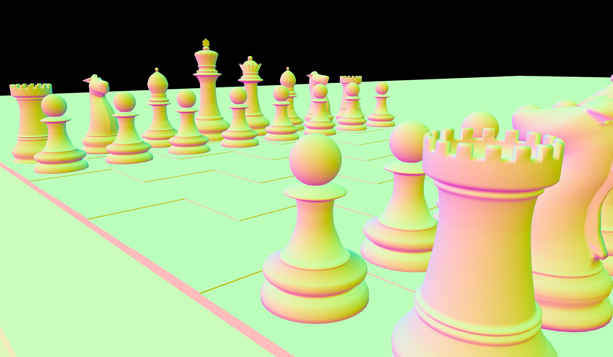
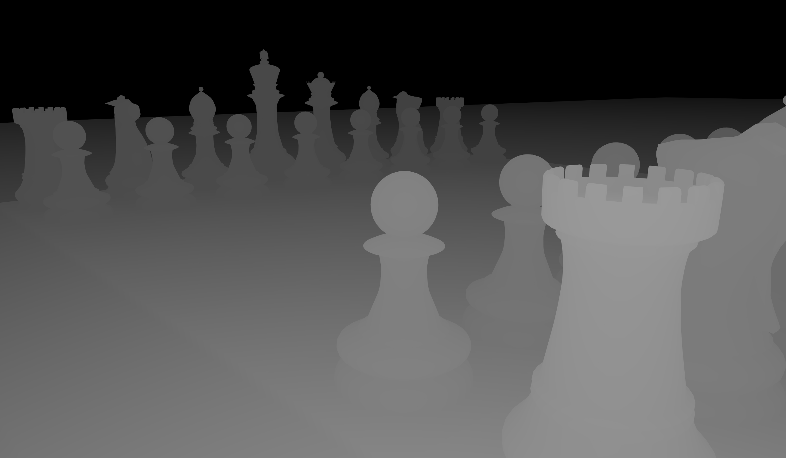
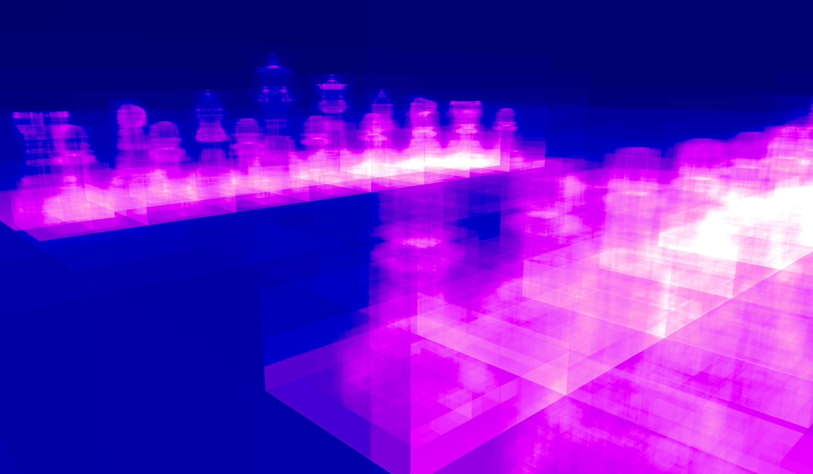
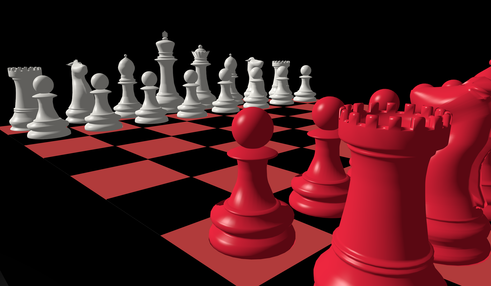
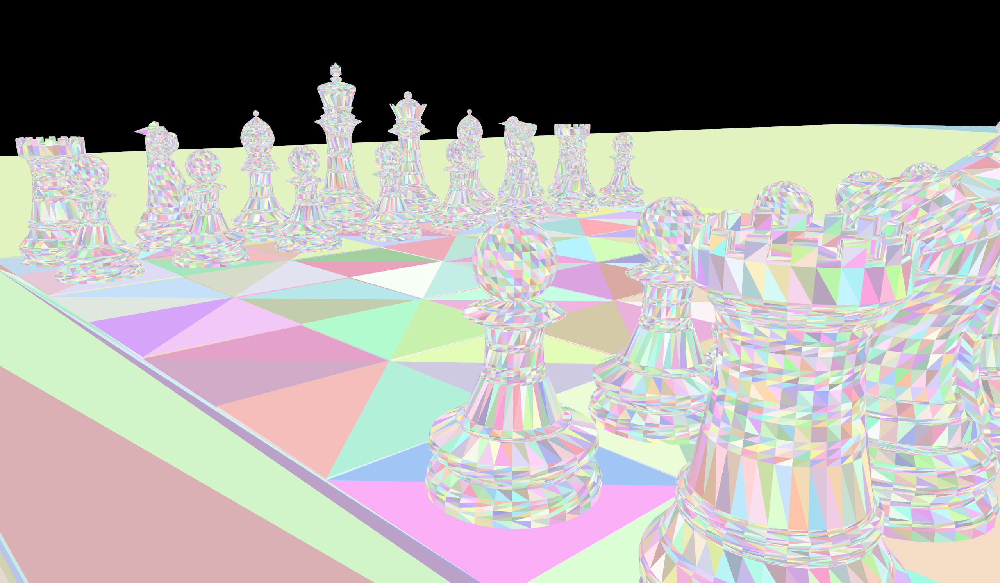
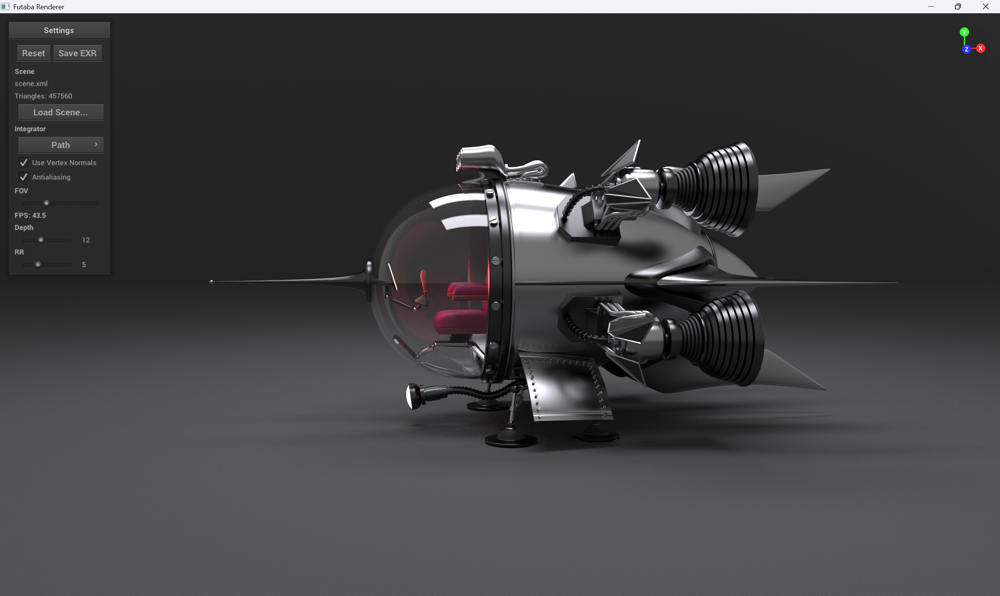
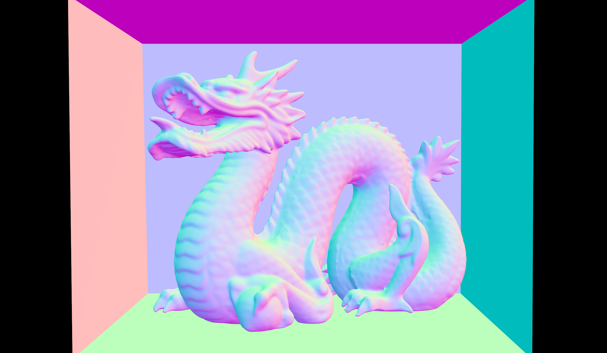
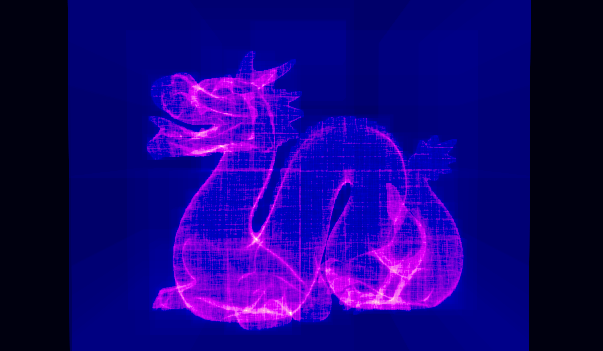
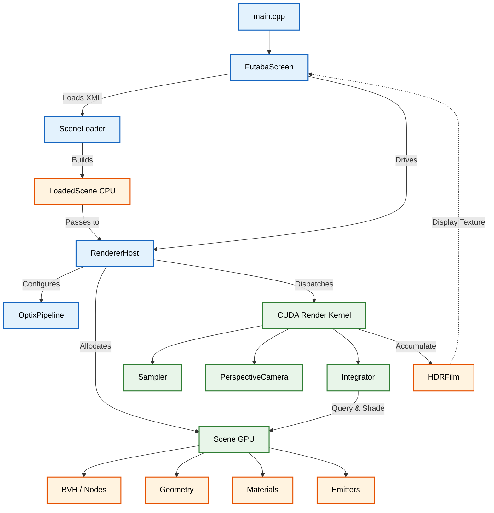

# Futaba Renderer

Futaba is a high-performance, learning-oriented physically-based renderer written in **C++ and CUDA**. Inspired by [Mitsuba](https://www.mitsuba-renderer.org/), this project focuses on clear architecture and the implementation of advanced rendering techniques.


## Available Visualizations

| Path Tracing | Albedo | Normals |
|:---:|:---:|:---:|
|  |  |  |
| **Depth** | **Heatmap** | **Phong** |
|  |  |  |
| **Primitives** | | |
|  | | |

## Project Goals

- **Educational**: Understand the internals of physically-based rendering (PBR) from first principles.
- **GPU Performance**: Utilize NVIDIA CUDA for high-performance ray tracing and Monte Carlo integration.
- **Path Guiding**: Implement advanced sampling techniques to improve convergence and reduce noise.
- **Modular Architecture**: Clean separation of concerns (integrators, shapes, materials, sensors, etc.).

## Features

### Current Implementation
- [x] **GPU Acceleration**: CUDA-based pipeline with NVIDIA OptiX hardware acceleration and an optimized software BVH fallback.
- [x] **Interactive UI**: Real-time viewport driven by NanoGUI featuring:
   
  - Smooth WASD navigation with gimbal-lock-free quaternion rotations.
  - On-screen orientation gizmo anchored to the top-right corner.
  - Responsive, non-distorting viewport that dynamically adapts to window resizing.
  - GPU toggles for Anti-aliasing and Smooth Shading.
  - Interactive FOV and depth sliders with real-time accumulation reset.

  
- [x] **Scene Parsing**: 
  - Loading logic based on the **Nori** renderer, with an overall structure based on a **Mitsuba hybrid** approach.
  - XML loader supporting nested `<transform>` blocks and advanced OBJ parsing.
- [x] **Integrators**: 
  - [x] **Path Tracing**: Full Monte Carlo integration with Russian Roulette.
    
  - [x] **Normals**: Surface normal visualization for debugging.
    
  - [x] **Heatmap**: AABB intersection complexity visualization.
    
- [x] **Films**: 32-bit HDR accumulation with zero-copy OpenGL PBO display and EXR export support.

### Planned Features
- [x] Done
  - [x] Normal Visualization
  - [x] Path tracing
- [~] Partially done
  - [~] Various Materials
  - [~] Textures and Environment map support
- [ ] Not started
  - [ ] Next Event Estimation (NEE)
  - [ ] Multiple Importance Sampling (MIS)
  - [ ] Path Guiding (PPG, SDMM, NPM etc.)
  - [ ] Bidirectional Path Tracing
  - [ ] Photon Mapping
  - [ ] Radiosity
  - [ ] Volume Rendering
  - [ ] Basic Differentiable Rendering

## Architecture Overview

### Rendering Pipeline

1. **Sensor**: Generates primary rays on the GPU based on camera orientation, optionally applying subpixel stochastic jitter for anti-aliasing.
2. **Ray Tracing**: Dispatches rays to **NVIDIA OptiX** pipeline modules (`__raygen__`, `__closesthit__`, `__miss__`), utilizing hardware RT cores for geometry queries.
3. **Integrator**: Computes radiance using CUDA kernels, resolving varying material types and debugging modes directly on the GPU.
4. **BSDF**: Evaluates physically-based material properties and samples indirect lighting paths.
5. **Film**: Accumulates floating-point samples directly into mapped OpenGL Pixel Buffer Objects (PBOs) for zero-copy, real-time screen display, while supporting CPU-side extraction for EXR archival.




## Building and Running

### Prerequisites
- **CUDA Toolkit**
- **CMake** (3.15+)
- **C++17** compatible compiler (MSVC 2019+, GCC, or Clang)

### Build
```bash
mkdir build && cd build
cmake ..
cmake --build . --config Release
```

## References

- [Mitsuba Renderer Documentation](https://www.mitsuba-renderer.org/)
- "Physically Based Rendering: From Theory to Implementation" by Pharr, Jakob, and Humphreys.
- [TinyEXR](https://github.com/syoyo/tinyexr) for HDR image I/O.

## License

This project is created for educational purposes.