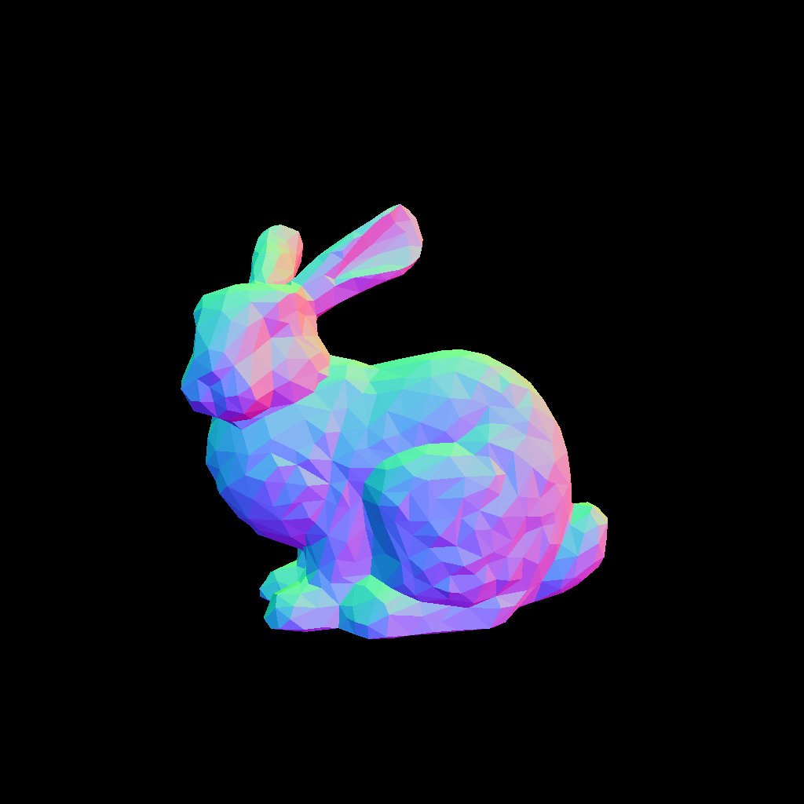

# Futaba Renderer

A learning-oriented implementation of a physically-based renderer, inspired by [Mitsuba](https://www.mitsuba-renderer.org/). This project aims to replicate core rendering concepts and implement advanced techniques like **path guiding** for efficient Monte Carlo rendering.

## Project Goals

- **Educational**: Understand the internals of physically-based rendering (PBR) from first principles
- **Path Guiding**: Implement advanced sampling techniques to improve convergence and reduce noise
- **Modular Architecture**: Clean separation of concerns (integrators, shapes, materials, sensors, etc.)
- **Extensibility**: Easy to add new features, materials, and rendering algorithms

## Features

### Current Implementation
- **Sensors**: Perspective camera with configurable FOV
- **Shapes**: Triangle meshes (OBJ format), spheres, and triangle primitives
- **BSDFs**: Basic surface reflectance models
- **Integrators**: 
  - Normal visualization
  - Simple path tracing
- **Films**: HDR film for output rendering
- **Samplers**: Pseudo-random and quasi-random sampling strategies
- **Acceleration**: Bounding Volume Hierarchy (BVH) for ray tracing

### Planned Features
- **Path Guiding**: Learn and adapt to scene-specific light transport patterns
- **Advanced Materials**: Rough conductors, dielectrics, and layered materials
- **Media**: Volumetric rendering support
- **Optimization**: GPU acceleration and advanced spatial data structures

## Architecture Overview

### Rendering Pipeline

1. **Sensor**: Generates primary rays from the camera
2. **Ray Tracing**: Find ray-scene intersections using BVH acceleration
3. **Integrator**: Compute radiance along ray paths using Monte Carlo integration
4. **BSDF**: Evaluate material properties and sample indirect lighting
5. **Film**: Accumulate samples and write final image

### Integrators

- **Normals**: Visualize surface normals for debugging
- **Simple**: Basic path tracing with Russian roulette termination planned (currently phong)

## Contributing

This is a learning project. Feel free to fork and experiment!

## References

- [Mitsuba Renderer Documentation](https://www.mitsuba-renderer.org/)
- "Physically Based Rendering: From Theory to Implementation" by Pharr, Jakob, and Humphreys
- Path Guiding papers and resources (to be documented)

## License

This project is created for educational purposes.