# Futaba Renderer

Futaba is a high-performance, learning-oriented physically-based renderer written in **C++ and CUDA**. Inspired by [Mitsuba](https://www.mitsuba-renderer.org/), this project focuses on clear architecture and the implementation of advanced rendering techniques.


## High Quality Renders

| Dragon Cornell Box | Depth of Field |
|:---:|:---:|
|  |  |
| **Volumetric Cornell Box** | **Veach MIS** |
| 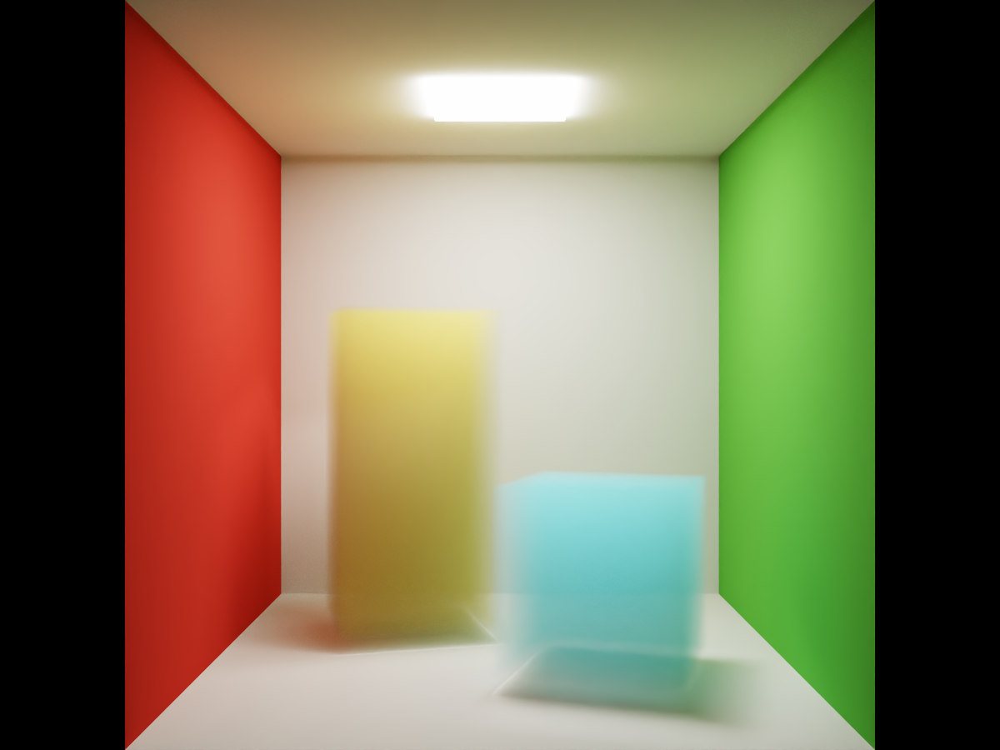 | 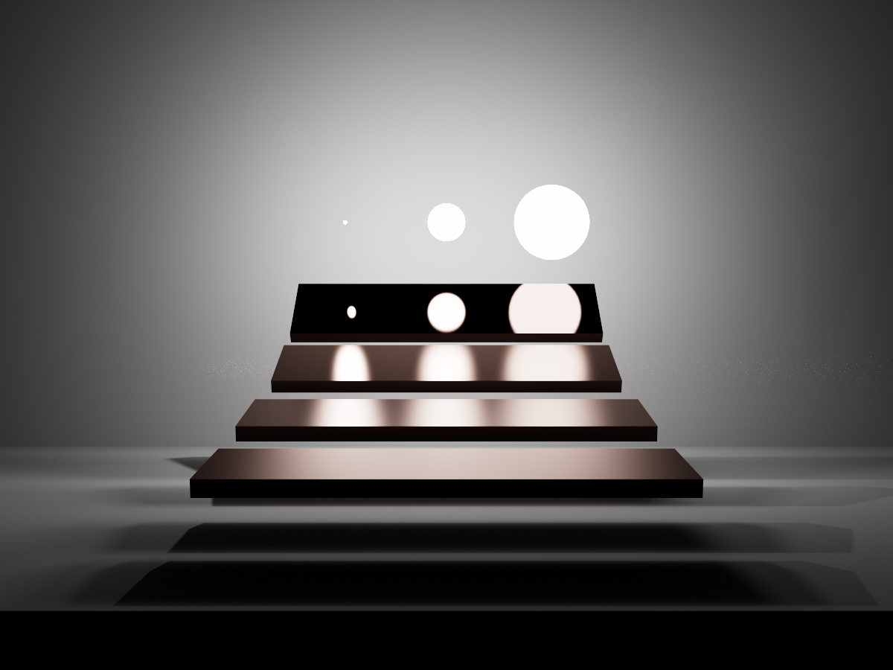 |


## Available Visualizations

| Path Tracing | Albedo | Normals |
|:---:|:---:|:---:|
|  | 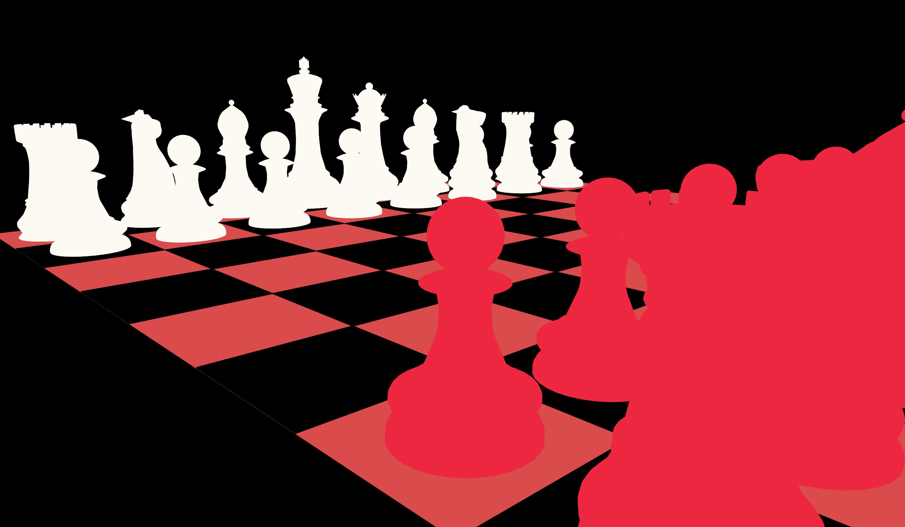 | 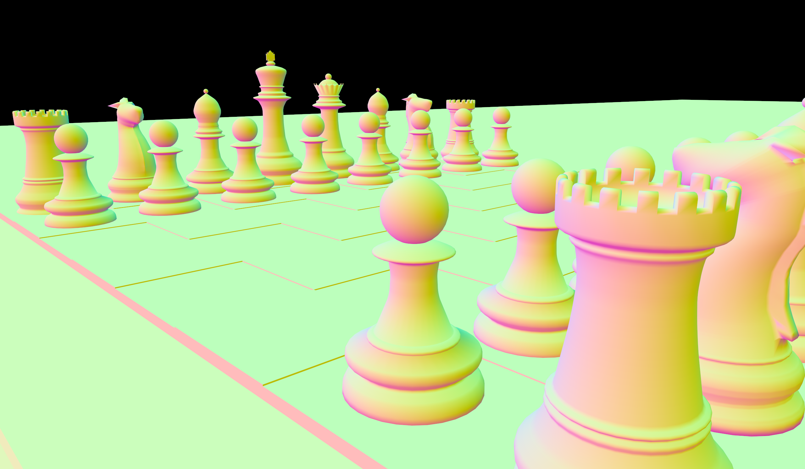 |
| **Depth** | **Heatmap** | **Phong** |
| 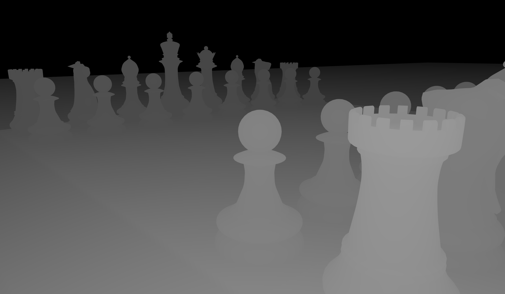 | 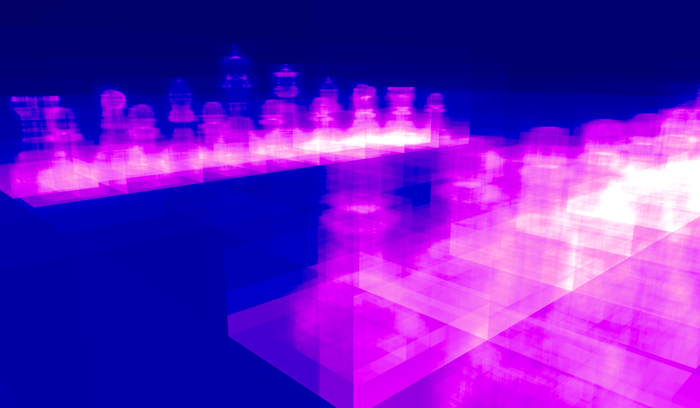 | 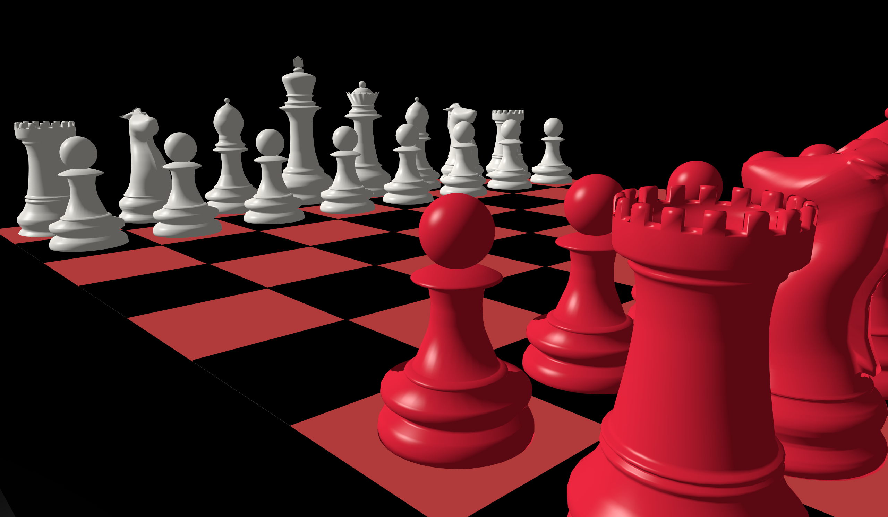 |
| **Primitives** | | |
| 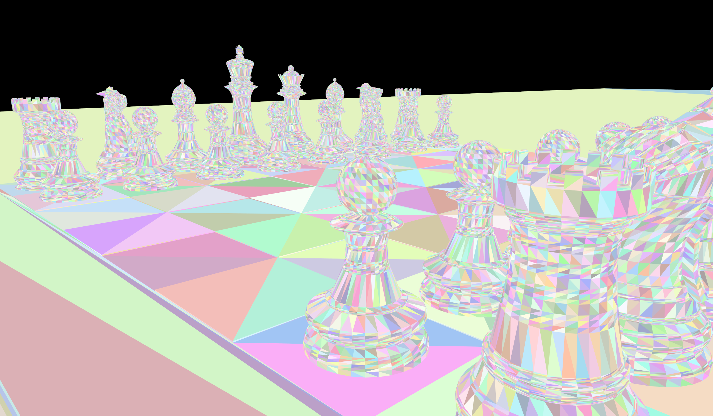 | | |

## Project Goals

- **Educational**: Understand the internals of physically-based rendering (PBR) from first principles.
- **GPU Performance**: Utilize NVIDIA CUDA for high-performance ray tracing and Monte Carlo integration.
- **Path Guiding**: Implement advanced sampling techniques to improve convergence and reduce noise.
- **Modular Architecture**: Clean separation of concerns (integrators, shapes, materials, sensors, etc.).

## Features

### Current Implementation
- [x] **GPU Acceleration**: CUDA-based pipeline with NVIDIA OptiX hardware acceleration and an optimized software BVH fallback.
- [x] **Interactive UI**: Real-time viewport driven by NanoGUI featuring:
   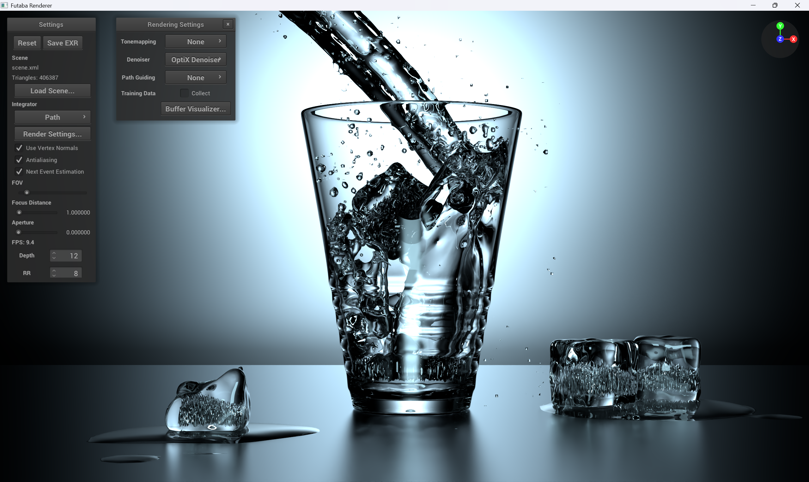
  - Smooth WASD navigation with gimbal-lock-free quaternion rotations.
  - On-screen orientation gizmo anchored to the top-right corner.
  - Responsive, non-distorting viewport that dynamically adapts to window resizing.
  - GPU toggles for Anti-aliasing and Smooth Shading.
  - Interactive FOV and depth sliders with real-time accumulation reset.

  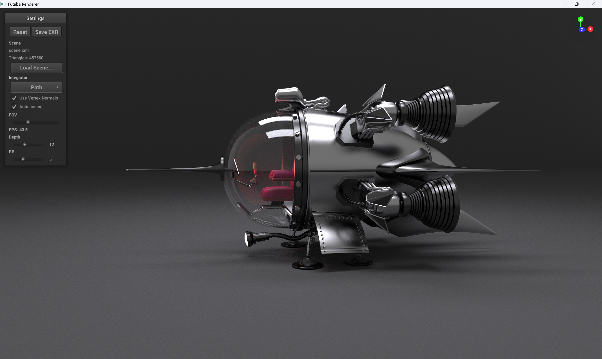
- [x] **Scene Parsing**: 
  - Loading logic based on the **Nori** renderer, with an overall structure based on a **Mitsuba hybrid** approach.
  - XML loader supporting nested `<transform>` blocks and advanced OBJ parsing.
- [x] **Integrators**: 
  - [x] **Path Tracing**: Full Monte Carlo integration with Russian Roulette.
    
  - [x] **Volumetric Path Tracing**: Radiative transport in homogeneous participating media with Henyey-Greenstein (HG) & Isotropic phase functions.
  - [x] **Next Event Estimation**: Direct-lighting support for emissive geometry and environment lighting with Multiple Importance Sampling (MIS).
  - [x] **Normals**: Surface normal visualization for debugging.
    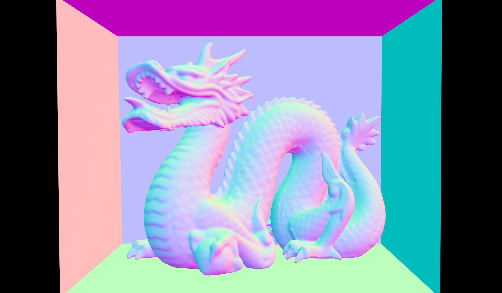
  - [x] **Heatmap**: AABB intersection complexity visualization.
    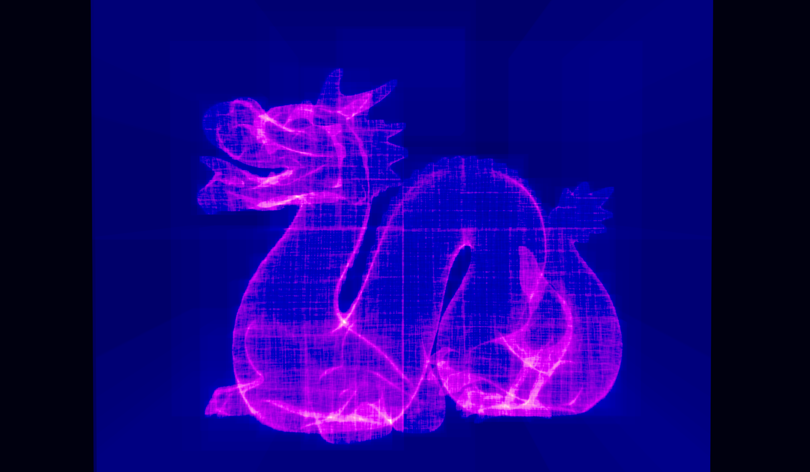
- [x] **Films**: 32-bit HDR accumulation with zero-copy OpenGL PBO display and EXR export support.
- [x] **Denoising**: Optional OptiX AI denoiser with albedo/normal guide buffers and tonemapped output.


#### Denoising Demo

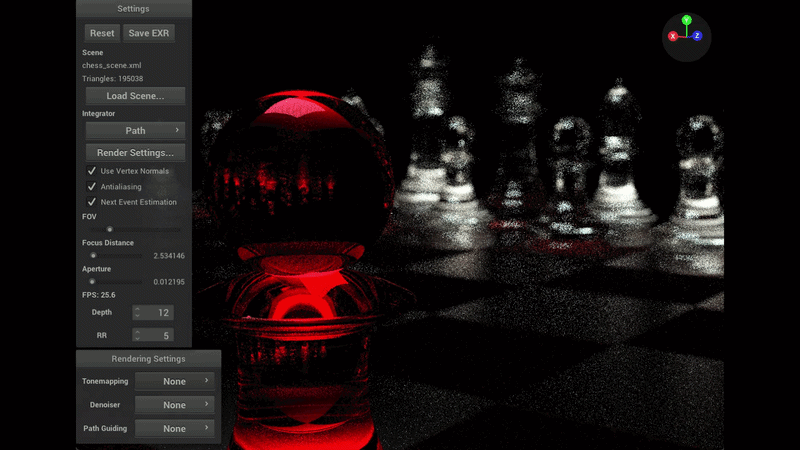

---

## Roadmap

- [x] Path tracing with Russian Roulette
- [x] Next Event Estimation with MIS
- [x] Volumetric path tracing (homogeneous media, HG phase function)
- [x] Environment map emitter with importance sampling
- [x] Thin-lens depth of field
- [x] Image textures on materials
- [x] Rough conductor / dielectric / plastic BSDFs (Beckmann microfacet)
- [x] OptiX AI denoising with guide buffers
- [ ] Path Guiding (PPG)
- [ ] Bidirectional path tracing
- [ ] Photon mapping
- [ ] Disney principled BSDF
- [ ] Bump / normal mapping
- [ ] Spectral rendering

---

## Architecture Overview

### Rendering Pipeline

1. **Sensor** --- generates primary rays on the GPU from the perspective camera, with optional thin-lens DoF and subpixel jitter for anti-aliasing
2. **OptiX Ray Tracing** --- dispatches rays through `__raygen__` / `__closesthit__` / `__miss__` programs using hardware RT cores
3. **Integrator** --- CUDA kernel computes radiance; selects path tracer or visualization mode
4. **BSDF** --- GPU-side material dispatch evaluates and samples the appropriate lobe (diffuse, microfacet, dielectric, etc.)
5. **Emitter Sampling** --- NEE samples area lights, point/directional lights, and environment map; MIS weights combine with BSDF sample
6. **Film** --- samples accumulate into a 32-bit float PBO for zero-copy OpenGL display; denoiser reads albedo/normal guide buffers and writes tonemapped output

```mermaid
%%{init: {'flowchart': {'curve': 'linear'}}}%%
flowchart TD

classDef cpu fill:#e3f2fd,stroke:#1565c0,stroke-width:2px,color:#000;
classDef gpu fill:#e8f5e9,stroke:#2e7d32,stroke-width:2px,color:#000;
classDef data fill:#fff3e0,stroke:#e65100,stroke-width:2px,color:#000;

main[main.cpp]:::cpu
FS[FutabaScreen]:::cpu
SL[SceneLoader]:::cpu
LS[LoadedScene CPU]:::data
RH[RendererHost]:::cpu

OPTIX[OptixPipeline]:::cpu
KERNEL[CUDA Render Kernel]:::gpu
SGPU[Scene GPU]:::gpu

SAMP[Sampler]:::gpu
CAM[PerspectiveCamera]:::gpu
INTG[Integrator]:::gpu
FILM[HDRFilm]:::data
DENOISE[DenoiserManager]:::gpu
RECORDER[PathRecorder\n(Denoiser Guide Buffers)]:::data

BVH[BVH / Nodes]:::data
TRIS[Geometry]:::data
MATS[Materials]:::data
EMITS[Emitters]:::data

main --> FS
FS -->|Loads XML| SL
SL -->|Builds| LS
LS -->|Passes to| RH
FS -->|Drives| RH

RH -->|Configures| OPTIX
RH -->|Allocates| SGPU
RH -->|Dispatches| KERNEL

SGPU --> BVH
SGPU --> TRIS
SGPU --> MATS
SGPU --> EMITS

KERNEL --> SAMP
KERNEL --> CAM
KERNEL --> INTG

INTG -->|Query & Shade| SGPU
INTG -->|Writes 1st-bounce albedo/normal| RECORDER
RECORDER -->|Feeds| DENOISE

KERNEL -->|Accumulate| FILM
FS -->|Executes Denoising| DENOISE
DENOISE -->|Denoises Beauty/Albedo/Normal| FILM
FILM -.->|Display Texture| FS
```

## Building and Running

### Prerequisites
- **CUDA Toolkit**
- **NVIDIA OptiX SDK** (for OptiX acceleration and the AI denoiser)
- **CMake** (3.15+)
- **C++17** compatible compiler (MSVC 2019+, GCC, or Clang)

### Build
```bash
mkdir build && cd build
cmake ..
cmake --build . --config Release
```

## References

- Müller et al., [*Practical Path Guiding for Efficient Light-Transport Simulation*](https://tom94.net/pages/publications/mueller17practical-erratum), EGSR 2017
- Pharr, Jakob, Humphreys --- *Physically Based Rendering: From Theory to Implementation* (PBRT)
- [Mitsuba Renderer](https://www.mitsuba-renderer.org/) --- scene format reference
- [TinyEXR](https://github.com/syoyo/tinyexr) --- HDR image I/O
- [NanoGUI](https://github.com/wjakob/nanogui) --- UI framework

## License

This project is created for educational purposes.